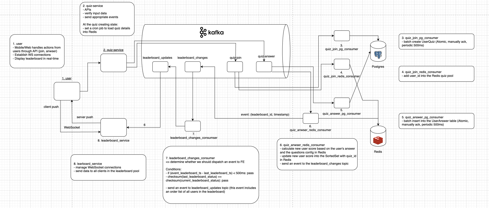
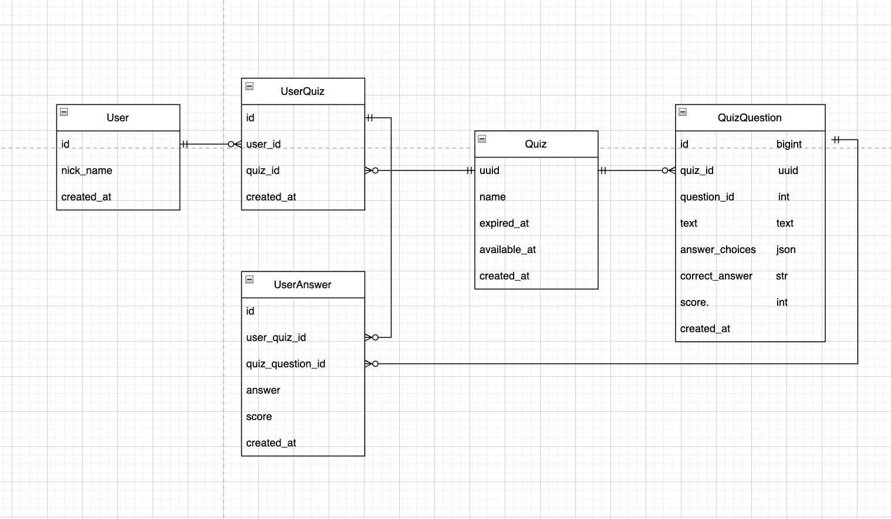
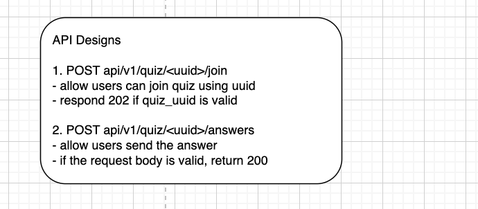

## System Design

### 1. Architecture Diagram

#### Assumptions

1. Allow submit after each question or all questions only one time => each question
2. When can users join a quiz? => after quiz available timestamp

### 2. Database Modeling and API Design

#### 2.1 Database Modeling

#### 2.2 API Designs

### 3. Component Description

#### 3.1 Web/Mobile

- Mobile/Web handles actions from users through API (join quiz and send answers)
- Establish WS connections
- Display the leaderboard in real-time

#### 3.2 Quiz-service

- Manage quizzes including Quiz, Questions, UserQuiz, etc.
- Verify input data (cache quiz data on Redis based on quiz's expiration time)
- Send the validated data to appropriate topics

#### 3.3 Quiz-Join-Database Consumer (Respond for the join quiz event)

- Batch create UserQuiz (Atomic, manually ack)
- Batch creates when total of messages reach a threshold or the last message exceeds 500ms

#### 3.4 Quiz-Join-Redis Consumer (Respond for the join quiz event)

- Add user_id into the Redis quiz pool

#### 3.5 Quiz-Answer-Database Consumer (Respond for the answering event)

- Batch creates the UserAnswer table (Atomic, manually ack, messages threshold and periodic 500ms)

#### 3.6 Quiz-Answer-Redis Consumer (Respond for the answering event)

- Calculate new user score based on the user's answer and the questions config in Redis
- Update new user score into the SortedSet with quiz_id in Redis
- Send an event to the leaderboard changes topic

#### 3.7 Leaderboard-changes-consumer (Response for determining whether to send new leaderboard to Frontend or not)

- Use last_leaderboard_changes to avoid overwhelming Frontend

#### 3.8 Leaderboard-service

- Manage WebSocket connections
- Send data to all clients in the leaderboard pool

### 4. Data Flow

#### 4.1 User Participation

**Brute force way**:
- Mobile/Web call API to join the quiz
- Quiz-service creates a new UserQuiz record

**Problems**:
- Overwhelm the quiz service if a large number of users join the quiz at the same time, leading to a crash
- Auto-scaling mechanism can create more instances to process incoming requests, but it takes time and the server can crash
- Scaling a large number of servers can reduce database performance or crash the database

**Solutions**:
- Use Kafka for storing incoming requests
- Allow time to scale specific parts of the system and guarantee availability

**Flow**:
- Mobile/Web call API to join the quiz
- Quiz-service validates the input data
- Push validated data into the quiz-join topic
- Two consumers consume that topic (one for storing data into Postgres and the other for caching necessary data in Redis)

**Concerns**:
1. Create UserQuiz in Postgres and add the user into the leaderboard pool in Redis asynchronously, which can lead to inconsistency:
    - Verify input at the quiz-service to ensure data correctness
    - Manually ack messages from Kafka to ensure processing even if the consumer crashes
    - Use transactions for bulk create

2. Overwhelm database with many connections:
    - Use a periodic task running every 500ms (adjustable based on real scenarios) to bulk-create UserQuiz

3. Eventual consistency:
    - In case of Redis or Postgres consumer crashes, ensure eventual consistency through previous setups
    - Investigate issues if consumers cause long-term inconsistency
    - Modify logic to verify input data at the quiz-service
    - Add two-phase commit mechanism

#### 4.2 Realtime Score Updates

**Brute force way**:
- Mobile/Web call API to answer the question
- Quiz-service creates a new QuizAnswer record
- Aggregate all user answers to get the current score

**Problems**:
- Have the same problems as the flow above
- Aggregating in the QuizAnswer takes a lot of time

**Flow**:
- Mobile/Web call API to answer the quiz
- Quiz-service validates the input data
- Push validated data into the quiz-answer topic
- Two consumers consume that topic (one for storing data into Postgres and the other for calculating score and updating leaderboard)
- Use SortedSet datatype in Redis to store leaderboard

**Concerns**:
- Same as the above concerns

#### 4.3 Realtime Leaderboard Updates

**Flow**:
1. The leaderboard_changes_consumer receives an event
    - Should we send a change event or not? If we send every event to the client, it'll be overwhelming with a lot of events
    - We use two conditions to determine the next action
        - Throttle duration (500ms): compare (incoming_event_ts, leaderboard_last_change_ts) < 500ms => pass
    - If we send an event
        - Update the leaderboard_last_change_ts in Redis
        - Send an event to the leaderboard-updates topic (this event includes an ordered list of all users in the leaderboard)

2. The leaderboard service receives an event
    - Send data to all clients in the leaderboard pool

### 5. Technologies and Tools

1. **Client Applications**: React (Web), React Native (Mobile)
    - React and React Native provide a consistent development experience and can share code between web and mobile platforms

2. **Backend Server**: Python with Django and FastAPI
    - In the case of real-time applications, we can use Node.js with Express due to its non-blocking I/O and scalability.
    - But in our case, we develop an English learning application. I will integrate with a lot of AI features. I think we should use Python to take advantage of large supportive libraries
    - Additional:
        - FastAPI uses the event loop mechanism we can take advantage of non-blocking I/O as Node.js
    - Django for backend server
    - Celery for running consumer, we can reuse code in the backend server

3. **Message Brokers**: Kafka
    - RabbitMQ was developed for financial applications at the beginning, so it is suitable for applications that need strong consistency like that
    - Kafka was developed by LinkedIn at the beginning for logging purposes; it has better performance than RabbitMQ

4. **Databases**: Postgres, Redis
    - MongoDB is suitable for applications with a write ratio greater than a read ratio. The latest MongoDB also supports ACID. It can be ideal for this application because of the high write ratio and flexible question schema
    - Postgres offers strong consistency, which is good for robust transactions. However, it doesn't support applications with a high write ratio compared with MongoDB. Because it's compatible with Django and we can handle the write ratio using the bulk create, I have chosen this data for this application

5. **WebSocket Server**: Socket.io with FastAPI
    - Socket.io can integrate with FastAPI to handle large connections at the same time

### 6. Monitoring and Observability
1. **Logging**: 

    Tools: ELK Stack (Elasticsearch, Logstash, Kibana)
    - Elasticsearch: Store and index logs for quick search and analysis.
    - Logstash: Collect, parse, and transform logs before sending them to Elasticsearch.
    - Kibana: Visualize logs and create dashboards for monitoring.

    Implementation:
    - Ensure all services log important events, errors, and performance metrics.
    - Use structured logging (e.g., JSON format) for easier parsing and analysis.
    - Centralize logs from all services using Logstash and store them in Elasticsearch.
    - Create Kibana dashboards to visualize logs and monitor key metrics.

2. **Metrics**:

    Tools: Prometheus, Grafana
    - Prometheus: Collect and store metrics from our services.
    - Grafana: Visualize metrics and create dashboards.

    Implementation:
    - Expose metrics (e.g., request count, response time, error rate) using libraries like prometheus_client for Python.
    - Set up Prometheus to scrape metrics from our services.
    - Create Grafana dashboards to visualize metrics and monitor the health and performance of our services.
    - Set up alerts in Grafana to notify you of any anomalies or issues.

3. **Tracing**:

    Tools: Jaeger, OpenTelemetry

    - Jaeger: Distributed tracing system to monitor and troubleshoot transactions in complex microservices environments.
    - OpenTelemetry: Collect traces and metrics from our services.

    Implementation:

    - Instrument our services with OpenTelemetry to collect trace data.
    - Use Jaeger to visualize traces and understand the flow of requests through our system.
    - Identify performance bottlenecks and diagnose issues by analyzing traces.

4. **Health Checks**:

    Implementation:

    - Implement health check endpoints in our services to report their status (e.g., /health).
    - Use tools like Prometheus to monitor the health check endpoints and alert you if any service is unhealthy.

5. **Error Tracking**:

    Tools: Sentry
    - Sentry: Monitor and track errors in our applications.

    Implementation:
    - Integrate Sentry with our services to capture and report errors.
    - Use Sentry’s dashboard to monitor error trends and diagnose issues.
